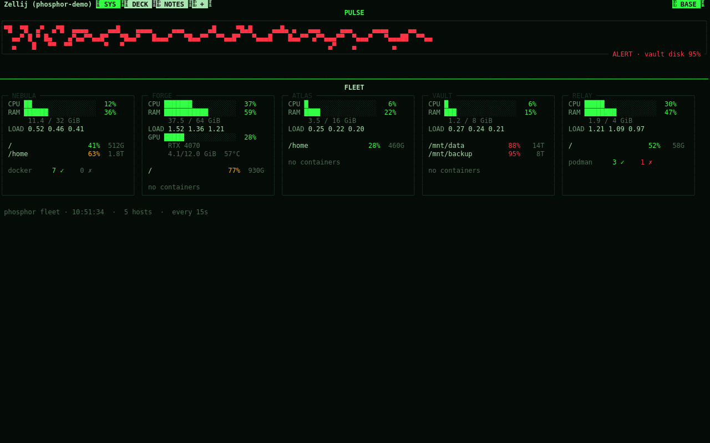
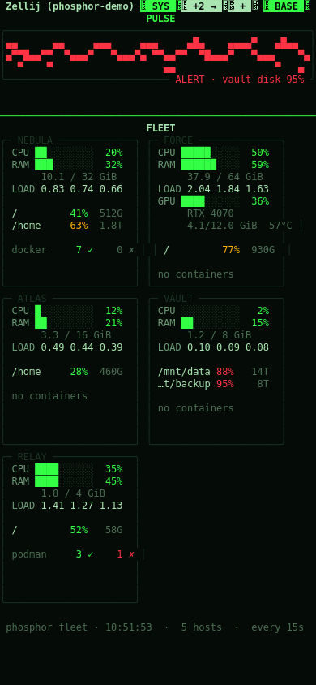
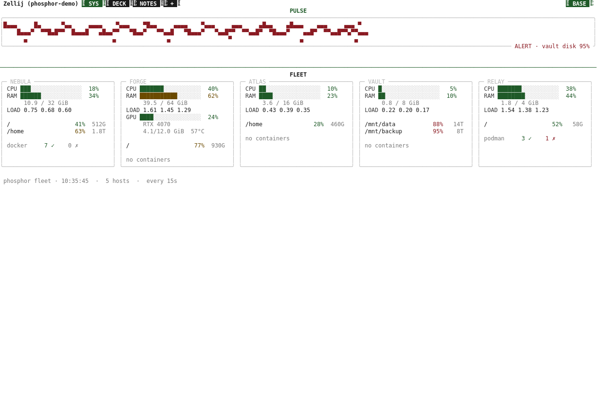
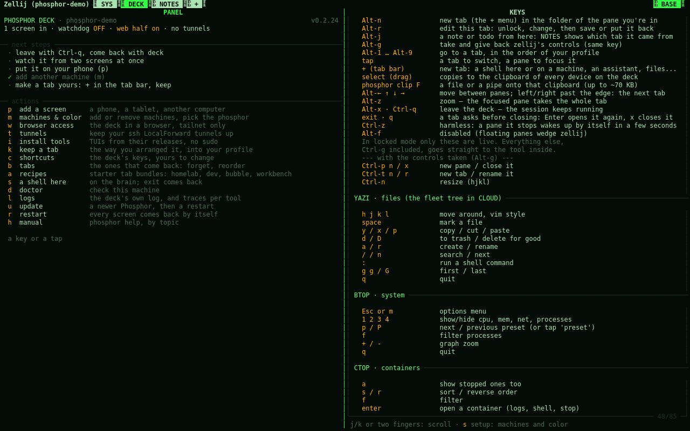

# Phosphor Deck

One always-on brain, many faces.

Your working session stops living inside a device. It lives on a machine
that never sleeps, and anything with a terminal is a window into it. Pick up
the phone and you're where you left off: same tabs, same scrollback, the
half-typed message still in the box.

The only thing you carry is one command. No launcher, no apps to open and
close, no browser dashboards: a handful of tabs, arranged once, with the
tools you actually use. Everything is text, every tool a static binary.

```
              ╔═══════════════════════════════════╗
              ║   BRAIN — the persistent session  ║
              ║   COMMS · WORK · SYS · CLOUD ...  ║
              ╚═════════════════╤═════════════════╝
                                │  ssh (or mosh)
        ┌──────────┬────────────┼────────────┬──────────┐
     desktop     tablet       phone         Pi        e-ink
```

Every screenshot below is `phosphor demo`: a throwaway session over
made-up machines and a made-up notebook, so a screenshot never carries a
real IP, hostname or note.



The same tab bar, on a phone-width screen: the fleet panel stacks into
one column instead of a row.



And on an e-ink screen: the `paper` theme, black on white, no glow.



## Quick start

Try it first, without touching anything of yours: a throwaway session over
made-up machines and a made-up notebook.

```sh
sh install.sh        # fetches zellij, yazi, btop... into ~/.local/bin, no root
phosphor demo        # look around; Alt-x leaves
phosphor demo --stop # kill it and clean up
```

Then the real one, on the machine that will stay on: `phosphor init && phosphor gen
&& phosphor up && deck` (or say yes to the installer's "set it up now?").

| you need | for |
|---|---|
| Linux with `systemd` | the watchdog and the mounts (without it `gen` still writes layouts) |
| `curl`, `tar`, `python3` 3.8+ | the installer and Phosphor itself (`tomli` if below 3.11) |
| `ssh` | only if you declare other machines |
| `fuse3` | only for the `~/fleet` mounts |

`phosphor doctor` checks all of it. Details under [Requirements](#requirements).

## What you get

- **One session, many viewers.** A persistent `zellij` session with a
  watchdog: if it dies, it's back within a minute.
- **Tabs, not apps.** Laid out once from your profile. Switch with Alt-1..9
  or by tapping the bar; tap a pane to focus it.
- **A menu behind the "+".** Tap it for a new tab: a shell here or on any
  machine, an installed assistant, files, or any command. **layout** opens
  several at once: pick a shape, then what goes in each pane (four
  assistants side by side in a few taps). Mark "keep" and
  the tab is written into your profile, so it survives restarts.
- **Fleet panel.** One card per machine: CPU, RAM, load, GPU, disks and
  containers, collected over SSH. Nothing gets installed on the other side.
- **Prometheus gauges.** If you already run Prometheus, `phosphor prom` draws
  your PromQL queries as bars, arcs and sparklines, colored by thresholds.
- **CI/CD status.** `phosphor ci` draws status cards for GitLab and GitHub
  pipelines: colored by state, with the failing job, the commit that broke it, and the last
  five runs underneath, so an idle repo still tells you what happened.
- **Services, at a glance.** `phosphor services` lists the brain's own systemd
  units -- Phosphor's own plus any of your homelab's you add -- colored by
  state, in the SYS tab.
- **Review from the deck.** `phosphor review` lists open merge/pull requests
  (GitLab or GitHub, detected from the remote): CI status, conflicts, the diff,
  and a key to check the branch out into its own worktree and try it, without
  touching your working copy.
- **A log that keeps what used to vanish.** A crash's traceback, a hang, a
  non-zero exit: `phosphor logs` reads them back (`l` on an "ended" pane
  does too), and `phosphor trace TOOL` turns on a verbose one for a while.
- **One file tree.** The disks of all your machines under `~/fleet`, mounted
  with `rclone`. Moving something between machines is an `mv`.
- **Read-only mentions.** Anything can pipe a notification into `phosphor
  mention-hook` (a bot, a script, a chat client's hook; `--setup` wires
  matterhorn for you): the chat tab reads "COMMS ●2" until you look, the SYS
  adjutant shows who and what, and tapping takes you there. It also reaches
  you off the deck, pushed to your phone or spoken, same as any other
  notification. Nothing is ever sent back, not even a canned reply. With
  `prepare` in the profile, "prepare notes" on a notification has any command
  that reads a prompt on stdin (`claude -p`, for one) write briefing notes
  into WORK NOTES, only when you press it.
- **The fleet tells you, not just shows you.** A host going down or coming
  back pushes to your phone and speaks up (with `[tts] fleet_alerts`) the
  same way `phosphor notify` does -- at most once a minute per host, so a
  flapping link doesn't flood you.
- **In a browser too, if you want.** `phosphor web on` publishes the deck with
  zellij's web client and `tailscale serve`: HTTPS, only your tailnet's devices,
  plus a login token. Off by default; never on the internet.
- **Your ssh tunnels, always up.** Hosts in `~/.ssh/config` with `LocalForward`
  lines: `phosphor tunnel on HOST` keeps them up with systemd and reconnects.
- **One clipboard for every screen.** Select text in the deck and it lands on
  the clipboard of every device looking at it, phone and PC at once.
  `phosphor clip file` sends a file; pasting the other way works as usual.
  In yazi, `c` then `t` does the same to the hovered file, no shell tab needed.
  For a real file (any size, saved as itself, not pasted text), `phosphor
  send file` opens a one-time link and QR, gone once it's downloaded.
- **A shared notebook.** `phosphor note` from anywhere (you, a script, an AI
  assistant) and it shows up in the NOTES tab, where `a` (or a tap) writes one
  without leaving the tab. Alt-j jots one from whatever tab you're in (SYS
  shows a full disk: a todo), and NOTES says where it came from; `f` shows one
  tab's notes. Tap a note to edit it, archive it, mark a todo
  done, or open an assistant that starts from it. Private by default; `[notes] folder` in the
  profile (`phosphor init` or `setup`) moves it into a vault you already sync -- Obsidian,
  Syncthing, git.
- **A tab per idea.** `phosphor workspace new` (or `w` on a note) makes a
  project folder with git and a tab with one or two AI assistants, each
  knowing its part and handing off through the workspace's own notebook.
- **Tabs that stay put.** Tabs are locked; Alt-r unlocks the one you're in,
  lets you resize, split or swap what runs in a pane, and then asks: save it
  into your profile, or put it back.
- **Tabs you can share.** Drop a `[[tabs]]` file into `~/.config/phosphor/tabs.d/`
  and it shows up in the deck, `phosphor gen` away, without touching your own
  profile -- its content is read-only from Alt-r and `keep`, which point at the file
  instead. `phosphor tabs` can still move it (`K`/`J`) wherever you want it, without
  moving its content out of that file.
- **Recipes.** `phosphor recipe` adds a starter bundle this way: `homelab` (prom and ci
  dashboards), `dev` (a two-assistant tab), `bubble` (mail, RSS, Mastodon, Matrix in one tab),
  `workbench` (four AI CLIs side by side). `phosphor init` also asks which shape fits how you'll
  use it (homelab, a leaner `revived` for one machine, or `dev`) and builds that from the start.
- **Phosphor colors.** P31 green, P3 amber, P4 white, or paper for e-ink.
  One setting recolors the whole deck -- zellij, the web client, and the
  tools it launches (yazi, btop, gping, ctop).
- **Declarative.** One file describes your world; `phosphor gen` builds the
  layouts, the systemd units and the mounts. `phosphor setup` edits it for you.
- **No root.** Static binaries in `~/.local/bin`. If something needs `sudo`,
  it tells you and carries on without it.

## Install

On the machine that will be the brain:

```sh
sh install.sh        # from a copy of the repo
```

It fetches the tools into `~/.local/bin` (static binaries, no root) and asks
"set it up now?": a short wizard, the deck starts, and you land inside it.
Pressing Enter on everything is a fine first run.

Leave with Alt-x or Ctrl-q: the session keeps running. **`deck`** brings you
back — the same word on the brain and on every other machine. When a tab's
program ends (`exit`, `q`) the tab says so in color and asks: Enter opens it
again, `x` closes the tab. A mistyped exit costs one key. If `phosphor` isn't
found, `~/.local/bin` isn't in your PATH yet: the installer prints the line to
add.

A newer version: `phosphor update` in a git clone, or `phosphor update FOLDER`
with a copy. It installs what's new and restarts the deck. The steps by hand
and how to remove it: `phosphor help install`.

`init` reads your tailscale peers and `~/.ssh/config`, leaves phones and
tablets out (they're viewers, never mounted), probes the rest over SSH and
offers their real disks. A handful of questions.

## Getting in

From another computer, `phosphor gen` on a non-brain machine writes the same
`deck` command (plain ssh; `connect = "mosh"` in the profile if you prefer mosh). From anywhere else, it's one line:

```sh
ssh -t you@brain ~/.local/bin/deck
```

**Another computer.** One line, and it has the `deck` command too:

```sh
ssh you@brain '~/.local/bin/phosphor screen' | sh
```

**Phone or tablet (Android + Termux).** Two lines in Termux:

```sh
pkg install -y openssh
ssh you@brain '~/.local/bin/phosphor phone' | sh
```

The brain answers with a small script made for your deck: it creates the
phone's key (your password, one last time), a `deck` command, a home-screen
icon through Termux:Widget, and extra keys for touch: `KEYBOARD` brings the
keyboard back (taps go to the deck), `EDIT` edits the tab you're in, `ZOOM`
gives one pane the whole screen, `EXIT` leaves. `phosphor phone` on the brain (or `p` in the DECK tab) prints these lines for
you, with the phone's one as a QR code to scan with the camera — no typing.

**tailscale, headscale, or neither.** Headscale is a self-hosted control
server for the same tailscale client, so the deck works the same with both;
`init` detects which one you use (`mesh` in the profile) and `phosphor phone`
tells the phone which server to log into. Plain ssh on a LAN works too:
`mesh = "none"`.

**ssh or mosh?** mosh survives the phone sleeping and switching networks, but
it doesn't carry the mouse, so touch stops working. Plain ssh carries touch;
if the connection drops, you tap the icon again and land exactly where you
were, because the session never left the brain.

## Keys

zellij runs in **locked mode**: it intercepts nothing, every key goes to the
tool inside. Only these are the deck's:

```
Alt-1..9       go to a tab (or tap it)
Alt-← ↑ ↓ →    move between panes (or tap one)
Alt-z          zoom: the focused pane takes the whole tab
Alt-x, Ctrl-q  leave — the session keeps running
Alt-n          new tab in the folder of the pane you're in
Alt-r          edit this tab: unlock, change, save or put it back
Alt-j          a note or todo from here: NOTES shows which tab it came from
Alt-g          take zellij's controls, and give them back
```

They were picked so they don't collide with `matterhorn`, which uses a lot of
Ctrl and Alt keys, and every one can be changed: `phosphor shortcuts` (or `c`
in the DECK tab). Your keys live in the profile, so updates never reset them.
The DECK tab lists the keys of every installed tool.

## The DECK tab

The deck's own tab, and the one place every phosphor command lives, even
when all your other tabs are ssh sessions somewhere else. On the left: its
state (screens in, watchdog, browser access, tunnels), the next steps while
you're still setting it up, and one key or tap per action: add a screen,
machines and color, browser access, tunnels, install tools, keep a tab,
tabs, shortcuts, a shell on the brain, doctor, update, restart, the manual. On the
right: the keys of every installed tool, with the deck's own as you set them.



**Machines and color** (`m` there, or `phosphor setup`):

- **add a machine** — finds it on tailscale, copies your key if needed, asks
  what it is and which disk to mount
- **remove a machine**
- **change the color** — with a preview of each phosphor
- **editor and shell** — what files open with and what shell panes run
- **apply** — regenerates and restarts the deck

It edits your profile as text, so your comments and custom tabs survive, and
leaves a `deck.toml.bak` behind.

## The profile

The single source of truth, in `~/.config/phosphor/deck.toml`. A shortened
example (the full one is `profiles/example.toml`):

```toml
[deck]
session = "deck"
theme   = "p31"

[[hosts]]
name   = "homelab"
role   = "brain"          # holds the session
local  = true
mounts = ["/", "~", "/mnt/media"]

[[hosts]]
name  = "workbox"
role  = "work"            # your projects live here
ssh   = "workbox"
mount = "/"

[[tabs]]
name  = "WORK"
panes = [ { ssh = "@work", reconnect = true } ]
```

Change it, run `phosphor gen`, and the deck rebuilds itself.

## The manual

Everything below, in depth, lives in [doc/manual](doc/manual/README.md):
`phosphor help TOPIC` shows it inside the deck, and [AGENTS.md](AGENTS.md), built from
the same pages, is what AI assistants should read. Contributing: [CONTRIBUTING.md](CONTRIBUTING.md).

## Commands

| | |
|---|---|
| `phosphor doctor` | preflight: locales, FUSE, systemd, PATH, fleet reach |
| `deck` | get in, from any machine (on the brain: `phosphor attach`) |
| `phosphor init` | profile wizard |
| `phosphor up` / `down` | start the deck (and at every boot) / stop it |
| `phosphor update` | a newer version: pull or copy, install, restart; `--channel nightly` or `stable` |
| `phosphor version` | this version, whether there's a newer one, and what it brings ([CHANGELOG](CHANGELOG.md)) |
| `phosphor setup` | add/remove machines, color, editor and shell, phone, browser access, tunnels, notebook |
| `phosphor panel` | the DECK tab: state, next steps, every action one key away |
| `phosphor phone` | put a phone or tablet one tap away from the deck |
| `phosphor gen` | generate layouts, units and mounts |
| `phosphor restart` | bring the session down cleanly and back up; every screen goes back in by itself |
| `phosphor note` / `notes` | write to / read the shared notebook |
| `phosphor workspace` | a tab per idea: folder, git, its assistants |
| `phosphor new` | the + menu (also Alt-n): a shell, a machine, an assistant, your apps, a layout |
| `phosphor keep` | write a tab you arranged by hand into your profile |
| `phosphor edit` | what Alt-r runs: unlock a tab, change it, save it or put it back |
| `phosphor shortcuts` | the deck's keys, yours to change; updates never reset them |
| `phosphor tabs` | the tabs your profile brings back: forget one, reorder, reopen |
| `phosphor recipe [NAME]` | starter tab bundles: homelab, dev, bubble, workbench |
| `phosphor fleet` | fleet panel |
| `phosphor pulse` | the heartbeat: a wave tied to real load |
| `phosphor glance` | read-only: fleet, unread mentions, open todos -- for a small screen, no zellij needed |
| `phosphor adjutant` | the SYS panel that speaks up: `phosphor notify MESSAGE` makes it announce something |
| `phosphor notify --push` | the same notice on your phone (ntfy), for a brain nobody sits near: `[push]` in the profile |
| `phosphor push --qr` | `[push]`'s status, or a QR to subscribe on the phone without typing the server/topic in |
| `phosphor tts` | speak notifications aloud with selectable voices (GLaDOS, Adjutant, HAL, Synth, System) |
| `phosphor ci` | GitLab/GitHub pipeline status cards (see `[ci]` in the profile) |
| `phosphor services` | systemd units and their state: Phosphor's own, plus any you add (see `[services]` in the profile) |
| `phosphor review` | open merge/pull requests: CI, conflicts, diff, try the branch in its own worktree |
| `phosphor screens` | who's attached (phone, tablet, another computer); `x` twice kicks one loose |
| `phosphor face` | turn an image into the adjutant's face |
| `phosphor keys` | key guide, updates itself when you install a tool |
| `phosphor store` | install TUIs from their releases, no sudo; open what you have, and your own apps |
| `phosphor path` | turns `~/fleet/x/y` into `host:/y` |
| `phosphor mentions` | read-only feed of chat notifications; `--setup` hooks matterhorn |
| `phosphor web` | on / off / status / token: the deck in a browser, tailnet only |
| `phosphor tunnel` | keep your ssh config's LocalForward tunnels up |
| `phosphor clip` | a file or a pipe onto your device's clipboard; `--save` the other way |
| `phosphor send` | one real file, as a one-time link and QR; any size, gone once it's downloaded |
| `phosphor logs` | the deck's own log: crashes with traceback, hangs, exits, restarts; `-f` follows |
| `phosphor trace` | verbose logging for one tool, for about 30 minutes, then it turns itself off |
| `phosphor help` | the manual, by topic; `phosphor docs` rebuilds AGENTS.md |
| `phosphor completion` | tab completion for bash or zsh (the installer adds it) |
| `phosphor demo` | a throwaway session over made-up machines, for a screenshot or a recording |
| `phosphor privacy` | before you push a fork: finds your own data in it |

## Your data

Phosphor runs no listening daemon, installs no agents on the machines it
watches and sends no telemetry anywhere.

- **Fleet metrics** come from sending a `sh` script over SSH and reading its
  output. Nothing stays installed on the other side.
- **Files** travel over SFTP inside SSH. With tailscale that's also inside
  WireGuard: encrypted twice, never touching the open internet.
- **The session** lives on your machine. Nothing syncs to a cloud.
- **No root.** Everything is in `~/.local` and `~/.config`. A bug's blast
  radius is your user, not the system.

What Phosphor does **not** control, honestly:

- The tools you run inside do what they do. Your chat client (matterhorn,
  iamb, gomuks...) talks to its own server; an AI client talks to its API.
  Phosphor adds no leaks, but it doesn't stop the ones you bring in.
- Those clients keep credentials on disk in `0600` files. That's standard,
  not magic: anyone with your user can read them.
- Fleet mounts mean the brain holds an SSH key into your other machines.
  Narrow it in their `authorized_keys`, e.g. with `from="100.64.0.0/10"` if
  you use tailscale.
- Your profile is personal: host names, IPs, users. It lives in `~/.config`,
  not in the repo. If you fork and push, run `phosphor privacy` first.

## Tested on

| | |
|---|---|
| Debian 12 | end to end, as the brain and in a clean container |
| Ubuntu 24.04 | as a remote fleet host; as the brain, a clean install in a systemd container (every push) |
| Fedora | the same container install as the brain, every push; Fedora Atomic as a remote fleet host and a viewer |
| Android (Termux) | as a viewer, with touch |
| Arch Linux | as the brain, real use, and the systemd-container install on every push |
| Alpine, NixOS, macOS, BSD | **never** |

Needs `systemd` for the watchdog and the mounts. Without it, `phosphor gen`
still writes the layouts but the units are useless.

## Requirements

`curl`, `tar`, `python3` 3.8+ (3.11+ has `tomllib` built in; older versions
need `tomli`), and `ssh` if you declare remote hosts. `fuse3` for the mounts.
`phosphor doctor` tells you what's missing and what it means.

If you run it on something that isn't listed above, say how it went — that's
the most useful thing the project can hear right now.

### Footprint

At rest, one local machine, no chat app (`tests/bench.py`, a throwaway session,
never the live deck): measured on an AMD Ryzen 5 3550H (8 cores, 13 GiB RAM).

| shape | RSS | CPU |
|---|---|---|
| revived (no CLOUD tab) | ~275 MB | ~6% of one core |
| homelab (adds yazi, btop, ctop) | ~395 MB | ~10% of one core |

A real fleet's polling cost isn't in this number yet — that needs a real fleet,
not a throwaway session.

Phone battery (Android's own battery usage screen, Termux, ssh not mosh, a
Pixel 9 Pro XL): **>1% over 3 hours** of mixed use -- some of it actively
looking at the deck, some of it just sitting connected in the background.
Android only reports ">1%" past that threshold, not an exact figure; a longer,
untouched-background run would give a tighter number.

## Status

0.3.0, and public. Day-to-day development happens on a private GitLab
(issues, merge requests, CI) -- this repository is where releases land,
starting from this one snapshot instead of that private history. That's
a choice about what's public, not a sign this showed up overnight: see
CHANGELOG.md for the pace of actual releases, and CONTRIBUTING.md for how
a change gets from an idea to a tag. Bug reports and feature requests are
welcome here.

## License

MIT
