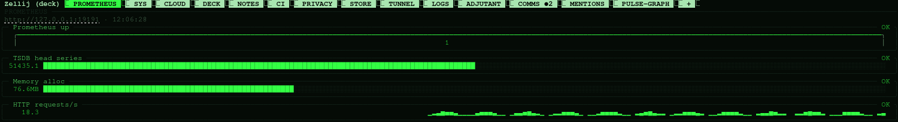

# The profile

You don't have to write tabs by hand: arrange the panes in zellij and
`phosphor keep` writes that tab here for you.

`~/.config/phosphor/deck.toml` (override: `PHOSPHOR_PROFILE`). `phosphor init`
writes it, `phosphor setup` edits it, you can edit it by hand; after a hand
edit run `phosphor gen && phosphor restart`. Until you do, the DECK tab's
status line says "profile changed: f applies it" (`f`, or a tap on that line,
asks, then runs both; if the restart doesn't happen, the line stays as "f
restarts it") and `phosphor doctor` warns; gen remembers what it read,
tabs.d included. Nothing applies it on its own: a restart closes every pane.
Files that gen writes say
"GENERATED BY phosphor gen": never edit those.

TOML takes a misspelled key without complaint, and the deck would just
ignore it: `phosphor gen` and `phosphor doctor` say so instead, with a
guess -- "[deck] unknown key thme: theme?", "[tts] unknown key enable:
enabled?", `theme = "p1"` isn't one of the themes, `web = "true"` is a
string, not true. They're warnings: gen still writes everything else.
The keys they know are the ones in the tables below (tabs.d files too).

## [deck]

| key | default | what |
|---|---|---|
| version | 1 | which shape the profile is: `phosphor init` writes the current one, `phosphor migrate` brings an older one up to date; leave it to them |
| session | "deck" | the session's name; it shows in the tab bar |
| command | "deck" | the one-word command that gets you in (`~/.local/bin/<it>`) |
| theme | "p31" | p31 green, p3 amber, p4 white, ega (the 16 colors of an old PC), paper (e-ink); `phosphor theme` previews them |
| mount_root | "~/fleet" | where the fleet's files appear |
| projects | "~/projects" | where workspaces are made (`phosphor workspace`) |
| mesh | auto | tailscale, headscale, none (plain ssh), or auto: detect |
| bar | "tabs" | tabs (tab bar with its + menu), compact, full (adds key hints) |
| editor | your $EDITOR, else nano | what panes open files with |
| shell | your login shell | what shell panes, + → shell and zellij's new panes run (bash, zsh, fish...) |
| connect | "ssh" | how other computers attach: ssh (mouse, touch) or mosh |
| web | false | the deck in a browser, tailnet only (`phosphor web on`) |
| web_port | 8443 | the HTTPS port tailscale serve publishes it on |
| notifier | false | floating adjutant on every tab; deprecated, goes in 2.1.0 -- see notifier below |
| graphs | "braille" | "blocks" draws the graphs with block characters, for fonts without Braille |
| face | "" | adjutant face (see `phosphor face`) |
| splash | true | a second of warm-up on the way in (any key skips it; never on paper, or when the same screen reconnects within a minute) |
| notify_seconds | 8 | how long a floating notice stays (notifier = true); deprecated with it |
| demo | false | fleet fakes its readings instead of polling ssh (what `phosphor demo` sets) |
| tour | false | a guide in a floating pane on every tab (what `phosphor demo --tour` sets; demo only) |

`notifier` opens a floating pane per tab for `phosphor notify`'s toast. It's
deprecated since 1.9.3 and goes in 2.1.0, with `notify_seconds`
(`phosphor migrate` drops both lines): the tab mark and `[push]` below
say the same without floating panes. It was
off by default: zellij 0.45's screen thread froze twice in real use, both
times right after `hide-floating-panes -t` ran across every tab -- shown or
not -- to clear the toast. No isolated repro exists for the freeze itself
(see issue #14), but that "touch every tab, whether it needs it or not"
pattern was the only clue there was, and it's gone: `phosphor notify` now
targets only the tab it actually showed the toast on, both to show it (a
bare `show-floating-panes`, with no tab named, can itself answer "Tab not
found" when called from outside the client -- naming the tab fixes that
too) and to hide it again. If you turn `notifier` on, this is lower-risk
than before, not risk-free.

With `notifier` off (the default) a notification still isn't silent: the
tab `phosphor notify` names (`--tab`, or SYS with none) reads "`<TAB> ●N`"
until you look, the same mechanism mentions.py uses for "COMMS ●2" (see
mentions) -- no floating panes, so none of the risk above.

`theme` recolors more than zellij and the web client: `phosphor gen` also
writes it into yazi's `theme.toml`, btop's own `phosphor` theme (set as
`color_theme` in `btop.conf`), and passes it to gping and ctop on their
command line (ctop only tells light from dark, so paper is the one theme
that inverts it). Each is left alone the moment it holds something gen
didn't write itself -- a `color_theme` you picked, a `theme.toml` of your
own.

## [[hosts]]

One block per machine.

| key | what |
|---|---|
| name | its name in the deck |
| role | brain (exactly one, and local), work, desktop, storage, node, viewer |
| local | true on the brain |
| ssh | ssh alias or host name |
| user | only if your user there differs |
| ip | optional; gping pings it |
| mount | remote folder shown in `~/fleet/<name>` (rclone sftp through your own ssh: ssh config, keys, known_hosts) |
| mounts | the brain's own folders shown in `~/fleet/<brain>/` (`/` → root, `~` → home, `/mnt/X` → X) |
| fleet | false keeps it in the deck but off the fleet panel |

Viewers are never polled or mounted. `@work`, `@desktop`… in a tab mean "the
first host with that role"; `@hosts` means all of them; `@mount_root` is
`~/fleet`.

## [[tabs]]

In order; Alt-1..9 go to them. `name`, optional `split` ("rows" or "cols"),
and `panes`, a list of pane specs:

| key | what |
|---|---|
| cmd | the program (`phosphor fleet`, `yazi`, …); empty: a shell |
| args | its arguments (`@...` tokens expand, see above) |
| ssh | a machine to ssh into instead of a program |
| reconnect | ssh panes: retry when the link drops (default true) |
| size | lines/columns, or a percentage like "55%" |
| cwd | working folder |
| needs_size | wait a second before starting (yazi, ctop read the size once) |
| alt | start on the alternate screen (gping, ctop) |
| split, panes | a container with its own panes |

Every program runs through `phosphor run` (see keys).

### tabs.d: tabs you can share

A `[[tabs]]` block dropped into `~/.config/phosphor/tabs.d/*.toml` (one file,
same shape as above) shows up in the deck without touching your own profile
-- pass someone a file, they drop it in, `phosphor gen`. They come after your
own tabs, in file-name order; a name your profile already uses wins.

Their content is read-only from the tools that edit your profile: Alt-r's
save and `phosphor keep` say which `tabs.d/*.toml` a tab comes from instead
of touching it. Edit that file by hand, then `phosphor gen`, to change one.

Their position isn't: `phosphor tabs` can still move one with `K`/`J`, the
same as any tab. The first time, it writes a name-only stub into your
profile -- `[[tabs]] name = "BUBBLE"` and nothing else -- marking where it
goes; its content still comes from tabs.d. `f` on a placed one takes the
stub back out (it returns to the end, in file-name order), not the tab
itself; the file it came from is never touched.

`phosphor recipe` drops a starter bundle in this same way (see commands).

## [[tunnels]]

| key | what |
|---|---|
| host | an ~/.ssh/config alias whose LocalForward lines the deck keeps up |
| config | optional: another ssh config file for it |

## [keys]

The deck's own keys (`phosphor shortcuts` changes them for you). Anything
left out keeps its default; `""` turns one off.

| key | default | what |
|---|---|---|
| edit | "Alt r" | edit this tab: unlock, change, save or put back |
| new_tab | "Alt n" | a new tab (the + menu) in the pane's folder |
| note | "Alt j" | a note or todo from here, tagged with the tab you're in |
| zoom | "Alt z" | the focused pane takes the whole tab |
| leave | "Alt x" | leave the deck (Ctrl-q always does too) |
| controls | "Alt g" | take and give back zellij's controls |
| tabs | "Alt" | this + 1..9 goes to a tab ("Alt", "Ctrl Alt", "Ctrl Shift") |
| panes | "Alt" | this + arrows moves between panes |

## [notes]

Where the shared notebook lives. Without this table it's private, at
`~/.local/share/phosphor/notes.md`. `phosphor init` asks (offering folders
with `.obsidian/`), and `phosphor setup` changes it later; either way,
whatever notebook you already had moves into the new folder, never
overwriting one that's already there.

| key | what |
|---|---|
| folder | a folder you already sync (Obsidian, Syncthing, git); `notes.md` goes inside it |

Phosphor syncs nothing itself: the folder reaches other machines however you
already sync it. The notebook stays one file (`notes.md`, plus
`notes-archive.md`), so it shows in Obsidian as a single long note, not one
note per entry. Editing it from Obsidian and from `phosphor note`/`notes` at
the same moment isn't merged: whichever save lands last wins, same as any
shared file edited from two places at once. Across machines, a real
conflict (both edited while offline from each other) becomes whatever
conflict file your sync tool makes -- Phosphor doesn't resolve it.

## [mentions]

| key | what |
|---|---|
| prepare | a command that writes briefing notes; the notification comes on stdin |
| by | the name shown in WORK NOTES |
| prompt | replaces the default briefing prompt ({sender}, {message}) |
| timeout | seconds before giving up (default 600) |

## [prometheus]

For `phosphor prom` (and "prometheus" in the + menu, which shows only with
this section). One card per gauge, colored by its thresholds; the error, if a
query fails, shows under it. Without this section the panel says what it is
and the lines to add, instead of errors; it rereads the profile by itself, so
saving it is enough.

| key | default | what |
|---|---|---|
| url | "http://localhost:9090" | your Prometheus |
| interval | 5 | seconds between redraws |

    [[prometheus.gauges]]
    name  = "Memory alloc"
    type  = "gauge"          # gauge (a bar), arc, sparkline
    query = "go_memstats_alloc_bytes / 1024 / 1024"
    min = 0
    max = 256
    warn = 128               # from here the card turns amber
    crit = 200               # and red
    unit = "MB"

A query answers with its first series. With a `url` and no gauges it shows
Prometheus watching itself:

## [ci]

For `phosphor ci` (and "ci" in the + menu, which shows only with this section). Status cards for GitHub Actions and GitLab pipelines: the latest run with its jobs, and under it a history of the five before it (so an idle repo still tells you what happened last). If a refresh fails the card stays, marked "stale", instead of turning red; a real error says what to do (a private project needs `glab auth login` or `GITLAB_TOKEN`). With no pipelines the panel says what it is and the lines to add, and picks them up as soon as the profile is saved.

| key | default | what |
|---|---|---|
| interval | 10 | seconds between redraws |

    [[ci.pipelines]]
    name     = "Frontend Build"
    provider = "github"       # github or gitlab
    repo     = "owner/repo"
    branch   = "main"
    token    = "env:GITHUB_TOKEN" # optional token or env var reference
    url      = "https://gitlab.example.com" # gitlab only: your own instance (default gitlab.com)

## [tts]

Voice announcements for notifications (`phosphor notify`, and anything that
calls it: a fleet host going down or coming back, a chat mention or DM).

| key | default | what |
|---|---|---|
| enabled | false | speak notifications aloud |
| voice | "glados" | voice profile: glados, adjutant, hal, synth, system |
| glados_path | "~/.local/share/phosphor/glados-tts" | path to GLaDOS-TTS installation |
| volume | 1.0 | volume (0.0 to 1.0) |
| fleet_alerts | false | also announce fleet health alerts |

`fleet_alerts` gates fleet health on top of `enabled`: with it off (the default),
a host going down or coming back still shows in SYS and pushes to your phone if
`[push]` is on, it just isn't spoken -- most people want a message meant for
them read aloud, not every blip of a machine nobody's looking at.

## [push]

Notifications on a phone that isn't attached (`phosphor notify` sends them, and
so does anything that calls it: a fleet host going down or coming back -- at
most one push a minute per host, even if the link flaps -- and a chat mention
or DM). The brain is often in a rack with nobody near it, so speaking
(`[tts]`) reaches no one; this sends the notice to an
[ntfy](https://ntfy.sh) topic, and the ntfy app on the phone rings and
vibrates, whether Termux is open or not. Off until you turn it on: **the
message text leaves the brain**.

| key | default | what |
|---|---|---|
| enabled | false | push every `phosphor notify` |
| url | "https://ntfy.sh" | the ntfy server: the public one, or your own (reachable from the brain) |
| topic | "" | the topic to publish on; subscribe to the same one in the phone's ntfy app |
| token | "" | for a protected topic: the token, or `env:VAR` to read it from the environment |
| priority | "default" | min, low, default, high, max (high and max make the phone sound loudly) |
| title | "phosphor" | the notice's title; the tab it came from is appended |
| open_web | true | with browser access on (`phosphor web on`), tapping the notice or its "open the deck" button opens the deck in the browser |
| clip | true | with `[tts]` on too, a notice the brain speaks carries what it said: the same audio, as an attachment the phone plays |

    [push]
    enabled = true
    topic   = "deck-9f3k2x7q"      # anyone who knows a public topic can read it: make it long and random

The clip is the voice the brain itself speaks in (`[tts] voice`; the synth
one when that voice isn't installed or fails), rendered once and played on
both ends. It follows `[tts]`'s own rules: a fleet alert carries one only
with `fleet_alerts` on. A server that refuses attachments, or a clip that
fails to upload, still gets the text.

On the public ntfy.sh a topic is only as private as its name; with your own server (or a token)
it's yours. Try it with `phosphor notify --push "hello"`: it says why if it can't send.

### Your own server, no cloud

ntfy is one Go binary; no Firebase, no account. Download a
[release](https://github.com/binwiederhier/ntfy/releases) for the brain's
architecture and run it:

    ./ntfy serve --listen-http <brain's tailscale IP>:8080 --cache-file ~/.local/share/ntfy/cache.db \
        --attachment-cache-dir ~/.local/share/ntfy/attachments --base-url http://<that IP>:8080

(the last two for the voice clip: without them your server takes the text only).

Point `[push] url` at `http://<that IP>:8080`, and the phone's ntfy app at
the same address instead of ntfy.sh (its server field, not just the topic).
Plain HTTP is fine over a tailnet: tailscale already encrypts the link, so
there's no certificate to manage. This is one process, not a phosphor
service -- keep it running yourself (a `systemd --user` unit is the usual
way) so it's still there after a reboot; phosphor only needs it reachable
at `url` when `phosphor notify --push` runs.

## [services]

For `phosphor services`, the SYS panel that lists systemd units and their
state. Phosphor's own units (the deck's service and watchdog timer, one
`fleet-*.service` per mounted host, one per `[[tunnels]]`) always show up,
straight from what `phosphor gen` actually writes -- nothing to configure
for those. `extra` adds your own homelab services.

| key | default | what |
|---|---|---|
| interval | 5 | seconds between redraws |
| extra | [] | your own units, by name (system scope; prefix `"user:"` for one of yours) |

    [services]
    extra = ["nginx.service", "postgresql.service", "user:some-timer.timer"]

A system unit's status is read without sudo (`systemctl show`, read-only);
a missing or misspelled name shows as "not found" instead of failing the
panel. `inactive` isn't shown as a problem -- a tunnel you turned off is
supposed to sit there -- only `failed` or a unit that doesn't exist gets a
loud color.

On a terminal the panel is a picker too: j/k or a tap picks a unit, `l`
reads its last 300 log lines, `r` restarts it and `s` starts or stops it,
each asking first (`y`). A system unit goes through `sudo`, and its
password prompt shows as usual; one of yours (`user:`) doesn't need it. The
deck's own service and timer are the exception: stopping them from a pane
inside the deck would take that pane down mid-answer, so it points you at
`phosphor restart` instead.

## [alerts]

Where a reading turns amber and where it turns red, the same for every
panel: FLEET's cards and their 24h history, glance, digest, the adjutant and
pulse. Amber is worth a look; red is what glance, digest, the adjutant and
pulse call out. Each metric is `[warn, bad]`; the battery counts down (amber
at or below its first number, red at or below its second, while
discharging).

| key | default | what |
|---|---|---|
| cpu | [60, 90] | CPU use, % |
| ram | [60, 90] | RAM use, % |
| gpu | [60, 90] | GPU use, % |
| disk | [80, 90] | every mount's use, % |
| temp | [70, 85] | CPU temperature, °C |
| battery | [30, 10] | battery left, %, while discharging |

    [alerts]
    disk = [75, 90]
    temp = 80

    [alerts.nimbus]
    disk = [90, 97]

`[alerts.NAME]` changes them for one host of `[[hosts]]`, on top of
`[alerts]`. One number instead of a pair is the red line alone; amber stays
where it was, or comes down with it. A metric that isn't one of these, a
pair the wrong way round or a host the profile doesn't have is a warning in
`phosphor doctor` and `phosphor gen`. The panels read it again when the
profile changes: no restart.

## [screens]

A deck for each kind of screen: one block per kind (lowercase letters and
digits), in its own zellij session. See phones for how a screen says
which kind it is.

| key | default | what |
|---|---|---|
| tabs | every tab | which tabs, by name, in this order |
| land | the first | the tab you arrive on |
| theme | the deck's | p31, p3, p4, ega, paper |
| graphs | the deck's | braille or blocks |
| skip | none | panes left out of its tabs, by their `cmd` (`["phosphor adjutant"]`): a screen too small or too slow for them; a tab left with none goes too |

    [screens.phone]
    tabs = ["SYS", "NOTES"]
    graphs = "blocks"

`phosphor gen` writes each kind's layout; `phosphor doctor` says which
kinds have a session up, and warns about a tab name that doesn't exist.

## apps.toml

Programs of your own, next to the profile (`~/.config/phosphor/apps.toml`,
override: `PHOSPHOR_APPS`). They show first in `phosphor store` as "yours"
and in the `+` menu, and open in a tab of their own.

    [[apps]]
    name = "lazygit"
    cmd  = "lazygit"
    desc = "git in a TUI"

| key | what |
|---|---|
| name | its name in the store and the + menu |
| cmd | the program: a name in your PATH, or a path (`~` works) |
| args | its arguments |
| desc | a line for the store |
| alt | start on the alternate screen |
| needs_size | wait a second before starting |

## panels.d

A panel of your own, in about 20 lines: one Python file in
`~/.config/phosphor/panels.d/` (override: `PHOSPHOR_PANELS`) with a class
built on phosphor's `ListPanel`, the kit every panel in the deck uses. It
gets the same keys and taps for free: j/k or the wheel to pick, a tap on a
row, a tappable key bar, a y/n question before an action, a pager for long
text. The file's name is the panel's name; its docstring's first line says
what it is.

    # ~/.config/phosphor/panels.d/backups.py
    """restic snapshots on the NAS"""
    import json, proc, tui

    class Backups(tui.ListPanel):
        TITLE, INTERVAL = "BACKUPS", 60
        KEYS = [("enter", "files"), ("f", "forget"), ("q", "quit")]

        def fetch(self):
            rc, out = proc.sh("restic snapshots --json", t=30)
            if rc:
                self.problem = out or "restic failed"
                return []
            return json.loads(out)

        def lines(self, w, sel):
            return [(tui.INV if i == sel else "") + " %s  %s" % (s["time"][:16], s["hostname"]) + tui.RST
                    for i, s in enumerate(self.rows)]

        def act(self, k, row):
            if k == "enter":
                self.page(proc.sh("restic ls " + row["short_id"], t=60)[1])
            else:
                self.confirm("forget %s?" % row["short_id"],
                             lambda: (proc.sh("restic forget " + row["short_id"])[0] == 0, "forgotten"))

`phosphor panels backups` opens it; it also shows as "yours" in `phosphor store`
and in the `+` menu, to open in a tab of its own.

| what | |
|---|---|
| `fetch()` | the rows, again every `INTERVAL` seconds; set `self.problem` to show a line instead |
| `lines(w, sel)` | one line per row (`tui.Head("title")` among them: a group's title, never picked) |
| `act(k, row)` | a key of `KEYS` on the picked row; Enter comes as `"enter"` |
| `TITLE`, `SUB` | the top bar, with the row count; or write `header(w)` yourself |
| `confirm(q, do)` | asks y/n, then runs `do()`, which returns `(ok, message)` |
| `say(text)`, `page(text)`, `line(label)` | a line under the keys, the pager, a line typed in |

The phosphor modules are importable (`tui`, `proc`, `deckconf`, `ui`).
It's your code, run as you, like a `cmd` in apps.toml. A file that doesn't
load says why in `phosphor panels`; a `fetch()` or an action that raises
shows the error in the panel instead of closing it. Files starting with `_`
are left out (a helper your panels share).
