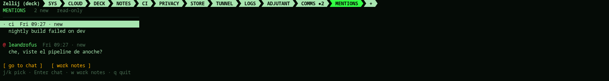

A feed of notifications: who, what, whether you were mentioned. Nothing is
ever sent back to the chat, not even a canned reply -- there is no way to
reply from here, on purpose.

## How a message becomes a notification

1. Someone mentions you, or sends you a direct message, in whatever chat
   client you run in the COMMS tab.
2. That client's own notification hook runs `phosphor mention-hook`, piping
   one JSON object on stdin: `{"from": ..., "message": ..., "mention": bool}`.
   It has to return at once and print nothing -- most chat clients show any
   output as an error, which is why `mention-hook` never does, whatever
   goes wrong on its end (a crash there is logged, never printed; see
   troubleshooting).
3. The notification is appended to a small file (`~/.local/share/phosphor/mentions.jsonl`,
   trimmed to the last 300) and to the events file the SYS adjutant reads,
   so it can announce who and what without you looking anywhere. It also
   reaches you off the deck the same way `phosphor notify` does: pushed to
   your phone if `[push]` is on, spoken if `[tts]` is on.
4. `fleet`'s always-on marker loop notices the feed has something unseen
   and renames the COMMS tab (or whichever tab is named `COMMS` or runs
   matterhorn, iamb or gomuks) to **COMMS ●N**.

5. Tapping that tab, or the marker loop simply seeing a client has arrived
   there, clears the count -- there's nothing to mark "read" by hand.

You can feed this from anywhere, not just a chat client: a script, a cron
job, a CI webhook -- anything that can shape a notification as that one
JSON object and pipe it in:

    echo '{"from": "ci", "message": "nightly build failed", "mention": true}' | phosphor mention-hook

For matterhorn specifically, `phosphor mentions --setup` does step 2 for
you: it writes the hook and points Mattermost's `activityNotifyCommand` at
it, so from then on every notification your own Mattermost preferences
allow (usually mentions and direct messages) lands here without you doing
anything per-message.

## Reading the feed

`phosphor mentions` (or `+` → mentions) lists what came in, newest first:

A notification doesn't carry which channel it came from -- your chat
client still owns that; this feed only tells you *that* something arrived
and *what it said*. `j`/`k` (or a tap) move between them; `q` leaves.

## Prepare notes

With `prepare` set in `[mentions]` (see profile), pick a notification and
press **p** (or tap "prepare notes"): the command you named gets a
briefing prompt on its stdin, and whatever it prints on stdout lands in
**WORK NOTES** (`phosphor notes --book work`) -- only when you actually
press it, never automatically. Keep that command read-only, since it's
about to read the notification and act on its own:

    prepare = 'cd ~/work-docs && claude -p --disallowedTools Bash Edit Write NotebookEdit WebFetch WebSearch'

The built-in prompt (replace it with your own via `prompt` in `[mentions]`)
asks whatever you point `prepare` at to read the folder's GEMINI.md /
AGENTS.md / CLAUDE.md / README first, summarize what's relevant to the
notification, and never reply to anyone -- it's preparing your own
reading material, not answering on your behalf. The message and whatever
documents that command reads go to that assistant's own provider, same as
any other call you make to it.
