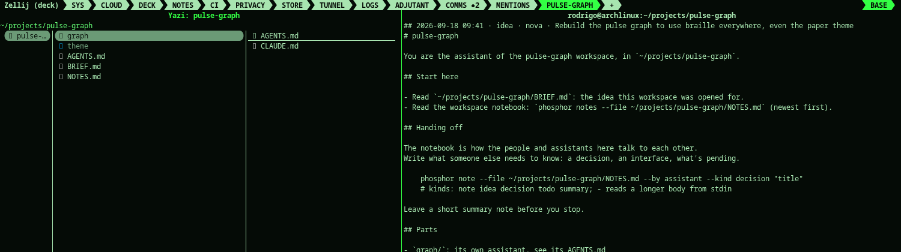

A workspace is a tab for one idea: its own folder, its own git repository,
and one or two AI assistants that know what they're working on.

## Opening one, start to finish

An idea comes up while you're looking at NOTES: you press `i` (idea), write
it, done -- it's a note, nothing more yet. Later you decide it's worth its
own tab: pick it, press `w`. Phosphor shows you the note (title, kind,
author, date) and asks if that's the one, then:

- creates `[deck] projects` (default `~/projects`) `/NAME`, `NAME` from the
  note's title;
- copies the note into `BRIEF.md`, and adds a line to the note itself
  saying where it went;
- writes an `AGENTS.md` per assistant (see below) and an empty `NOTES.md`;
- asks what shape the tab is (see the table), then adds it to your
  profile and opens it.

The same thing, without a note: the tab bar's `+` → **workspace**, or
`phosphor workspace new NAME` from a shell.

| shape | the tab |
|---|---|
| one | one assistant in the workspace folder |
| two | two assistants side by side, each in its own part (`frontend/`, `backend/` or any two names) |
| shell | an assistant and a shell next to it |

The tab is kept in your profile like any other, so it comes back after
`phosphor restart`. What "comes back" means depends on the assistant:
**claude** resumes its last conversation there (`claude --continue`, or a
fresh one if there wasn't one yet), and so does **aider**
(`--restore-chat-history`); **gemini**, **codex** and **opencode** just
start over -- there's no equivalent for them yet, so whatever context they
had lives only in that session and in what got written to the notebook
before it ended.

The first time a pane starts, that assistant is asked to read its own
`AGENTS.md` and `BRIEF.md` and say where things stand -- so arriving at a
workspace you didn't just create still tells you something.

## What's in the folder

| file | what |
|---|---|
| AGENTS.md | who this assistant is, which folder it owns, how to hand off |
| CLAUDE.md / GEMINI.md | `@AGENTS.md`, for the assistants that read their own file |
| BRIEF.md | the note the workspace was opened from (if any) |
| NOTES.md | the workspace's own notebook |

Nothing that already exists is overwritten: `phosphor workspace new` on a
folder you have adds only the missing files, and says which ones it left alone.

## Two notebooks, not one

Easy to mix up, so worth saying plainly: **Alt-j**, anywhere in the deck
(workspace tab included), writes to *your* notebook -- the one `phosphor
notes` shows, tagged with whatever tab you were in. It's yours, for you.

The workspace's own `NOTES.md` is a different file, and nothing writes to
it automatically. It's how the assistants -- and you, if you want in on it
-- hand work to each other on purpose:

    phosphor note --file ~/projects/NAME/NOTES.md --by backend --kind decision "the API returns JSON"
    phosphor notes --file ~/projects/NAME/NOTES.md

Every workspace `AGENTS.md` tells its assistant this same command, so it
knows to leave a note before it stops rather than let context evaporate
when the pane restarts. Nobody types into another assistant's pane --
the notebook is the only channel between them.

You don't have to go polling it to find out: the moment a workspace's
`NOTES.md` changes, its tab gets marked the same way a chat mention marks
COMMS (`<TAB> ●N`, no floating panes -- see mentions), cleared the moment
you actually look at that tab.

## Commands

- `phosphor workspace new [NAME] [--shape one|two|shell] [--parts "a b"] [--assistant claude|gemini|codex|opencode|aider]`
  `[--brief FILE | --note TEXT] [--folder-only]` — `--note` takes the note whose title contains TEXT;
  `--folder-only` writes the folder and leaves the profile and tabs alone (an assistant can use it).
- `phosphor workspace open NAME` — go to its tab, or open it (inside the deck).
- `phosphor workspace list` — the workspaces in your projects folder.
